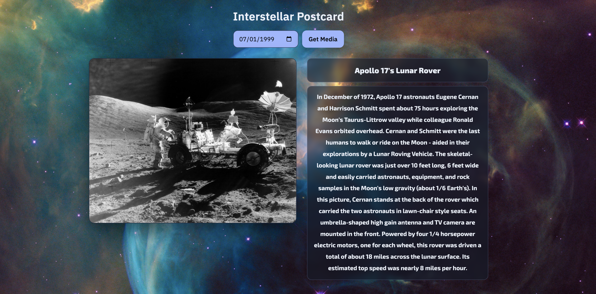

# Interstellar Postcard — NASA APOD Viewer

A simple front-end that fetches NASA’s **Astronomy Picture of the Day (APOD)** and displays it with a drifting space background.  
The layout shows the **media on the left** and the **title + description on the right** for easy viewing without scrolling.

**Link to project:** (https://simple-nasa-api-three.vercel.app/)  

---

## How It's Made:
**Tech used:** HTML, CSS, JavaScript  

I built this project to practice working with a public API and keeping the UI simple and readable.

**HTML:**  
A few semantic sections with small kebab-case classes (`hero`, `controls`, `result`, `result-media`, `result-text`).  
The result panel starts hidden and only appears after a successful fetch.

**CSS:**  
- Two-column grid: media on the left, text on the right.  
- Subtle moving background using a single `body::before` layer + keyframes (no JS).  
- “Glassy” card behind the text for legibility.  
- Mobile breakpoint collapses to one column.

**JavaScript:**  
- Builds the APOD URL from the selected date and fetches JSON from `api.nasa.gov`.  
- Switches between `` and `<iframe>` based on `media_type`.  
- Clears the `iframe.src` when leaving video so hidden audio doesn’t keep playing.  
- Fills title/description and unhides the results section.

---

## Optimizations
- Add a lightweight loading state while fetching.  
- Add friendlier error messages for invalid dates or API rate limits.  
- Keyboard shortcuts: **Enter** to submit, **← / →** to switch days.  
- Cache recent results in `localStorage` for faster reloads.  
- Shareable links using `?date=YYYY-MM-DD`.  
- Add a “Favorites” feature with thumbnail previews.

---

## Lessons Learned
- Handling mixed media (image vs video) from a public API without complicating the UI.  
- Unloading hidden iframes prevents surprise audio and reduces resource usage.  
- You can get a lot of motion and structure using pure CSS Grid + keyframes.  
- Hiding content until data arrives makes the interface feel intentional and finished.
